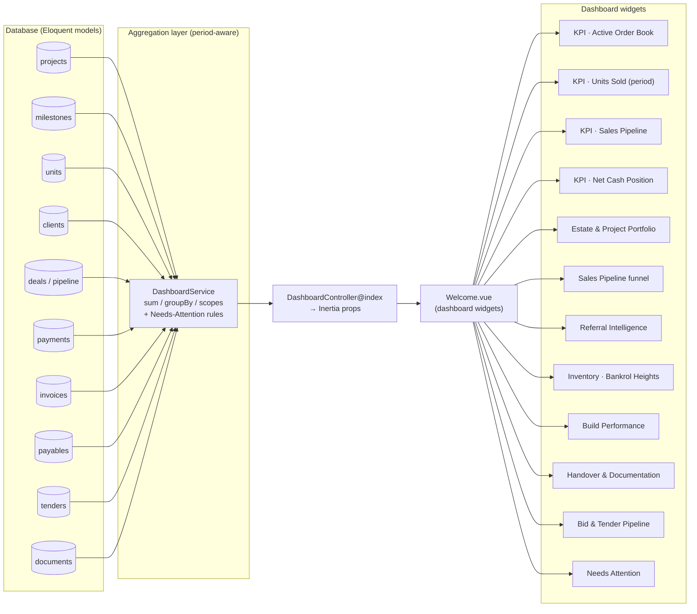
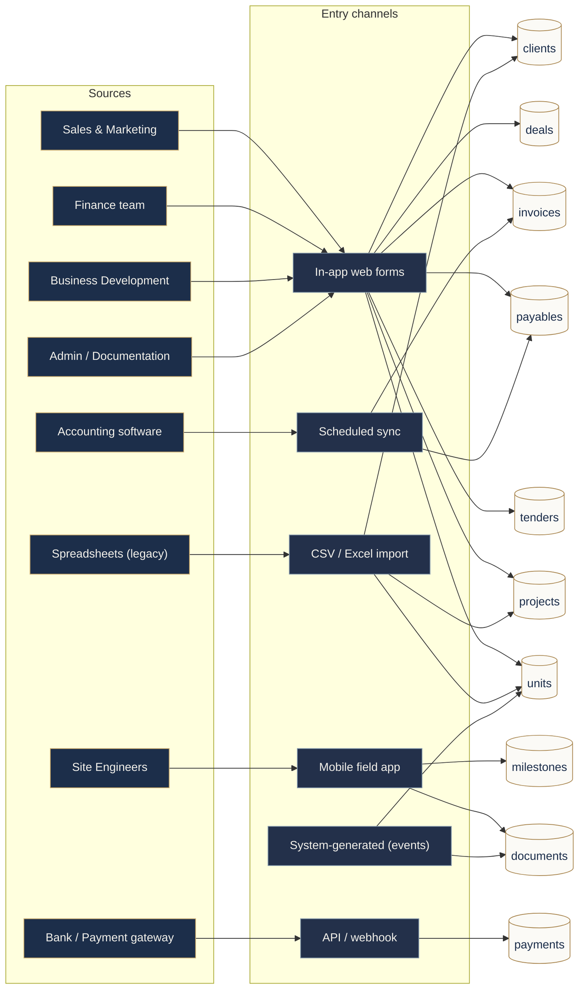

# Bankrol Dashboard — Data Map

How each dashboard widget is computed and where the data comes from.
Today these values are hard-coded in `resources/js/pages/Welcome.vue` (the `v`
computed). The diagrams below show the target data flow once wired to a Laravel
backend.

## 1. Data flow — source → dashboard



## 2. Widget → metric → source

```mermaid
flowchart TB
    classDef src fill:#FBFAF6,stroke:#A8854E,color:#1C2E4A;
    classDef wid fill:#1C2E4A,stroke:#C9A86A,color:#F4F1EA;

    AOB["Active Order Book\nΣ contract_value (active)"]:::wid --> P1[("projects")]:::src
    US["Units Sold · period\nΣ price WHERE sold in period"]:::wid --> U1[("units")]:::src
    SP["Sales Pipeline\nΣ value (negotiation + reserved)"]:::wid --> D1[("deals")]:::src
    NC["Net Cash Position\nreceivables − payables"]:::wid --> PAY1[("payments")]:::src
    NC --> INV1[("invoices")]:::src
    NC --> PB1[("payables")]:::src

    PORT["Estate & Project Portfolio\nvalue · build% · health"]:::wid --> P2[("projects")]:::src
    PORT --> M1[("milestones")]:::src
    FUN["Sales Pipeline funnel\nvalue + count by stage"]:::wid --> D2[("deals")]:::src
    REF["Referral Intelligence\nclose-rate · Σ by referrer"]:::wid --> C1[("clients.referred_by")]:::src
    REF --> D3[("deals")]:::src
    INVT["Inventory · Bankrol Heights\nunits by status"]:::wid --> U2[("units")]:::src
    BP["Build Performance\ncost_to_date vs budget"]:::wid --> P3[("projects")]:::src
    BP --> M2[("milestones / costs")]:::src
    HND["Handover & Documentation\n4-step status per unit"]:::wid --> DOC1[("documents")]:::src
    HND --> U3[("units")]:::src
    TEN["Bid & Tender Pipeline\nvalue · stage · win-rate"]:::wid --> T1[("tenders")]:::src
    NA["Needs Attention\nrules engine"]:::wid --> P4[("projects")]:::src
    NA --> INV2[("invoices")]:::src
    NA --> D4[("deals")]:::src
    NA --> DOC2[("documents")]:::src
```



## 3. Entity relationships

```mermaid
erDiagram
    CLIENTS ||--o{ DEALS : "has"
    CLIENTS ||--o{ PAYMENTS : "makes"
    CLIENTS ||--o{ INVOICES : "billed"
    CLIENTS ||--o{ CLIENTS : "referred_by"
    PROJECTS ||--o{ UNITS : "contains"
    PROJECTS ||--o{ MILESTONES : "tracked by"
    UNITS ||--o{ DEALS : "subject of"
    UNITS ||--o{ DOCUMENTS : "paperwork"
    UNITS }o--|| CLIENTS : "buyer"
    TENDERS }o--|| CLIENTS : "for"
    SUPPLIERS ||--o{ PAYABLES : "owed"

    PROJECTS {
        string name
        string category
        bigint  contract_value
        bigint  budget
        string  health
        date    target_date
        string  engineer
    }
    UNITS {
        string code
        string status
        bigint price
        fk     buyer_id
    }
    CLIENTS {
        string name
        string status
        string exec
        fk     referred_by_id
    }
    DEALS {
        string stage
        bigint value
    }
    INVOICES {
        bigint amount
        date   due_date
        string status
    }
    PAYMENTS {
        bigint amount
        string method
        date   paid_at
    }
    TENDERS {
        string name
        bigint value
        string stage
        string outcome
    }
    DOCUMENTS {
        string type
        string status
    }
    MILESTONES {
        string name
        string status
        int    pct
        bigint cost_to_date
    }
```

## 4. Data entry — how the database gets populated

Five channels from ~8 sources. Most figures are entered once at the point they
happen; payments and accounting can be automated so they aren't hand-entered.



| Channel | Source | Writes to |
|---|---|---|
| In-app web forms | Sales, Finance, Bizdev, Admin | clients, deals, invoices, payables, tenders, projects, units |
| Mobile field app | Site engineers | milestones, documents (photos) |
| API / webhook | Bank / payment gateway | payments |
| Scheduled sync | Accounting software | invoices, payables |
| CSV / Excel import | Legacy spreadsheets | clients, units, projects |
| System-generated | The app (events) | documents, unit status |

## Notes

- **Derived, not stored:** the 4 KPIs, funnel totals, referral close-rate,
  tender win-rate (`won ÷ total`) and the Needs-Attention list are computed in
  the service layer, not columns.
- **Period filter:** the `This Month / Quarter / Year` toggle applies a date
  range to "sold / closed" queries — primarily the **Units Sold** KPI.
- **Wiring path:** `DashboardController@index` runs the aggregations →
  returns Inertia props → `Welcome.vue` reads `props` instead of the hard-coded
  `v` arrays.
